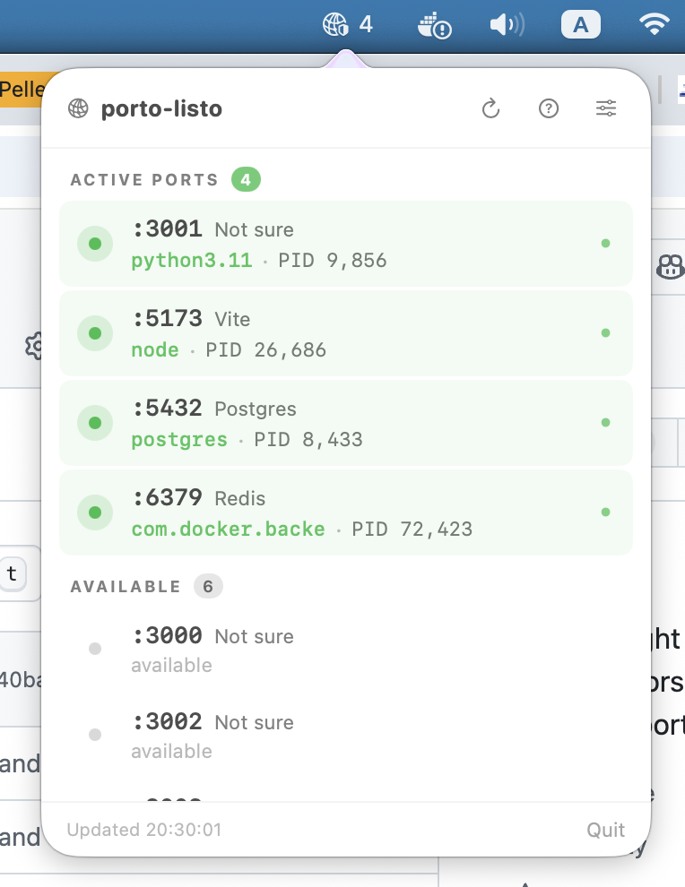
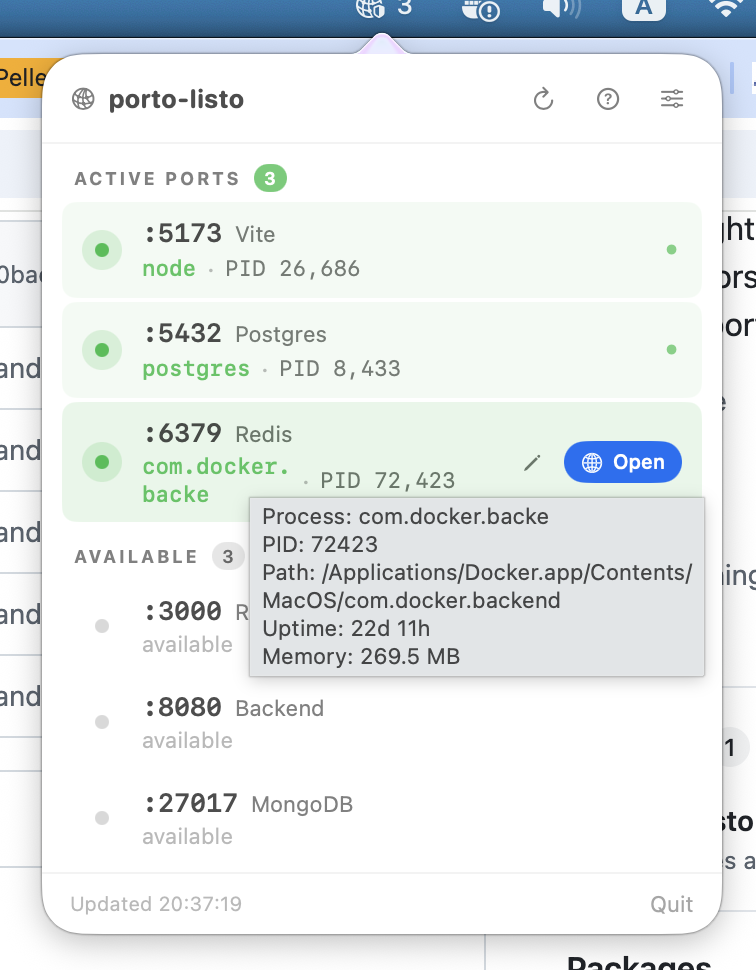
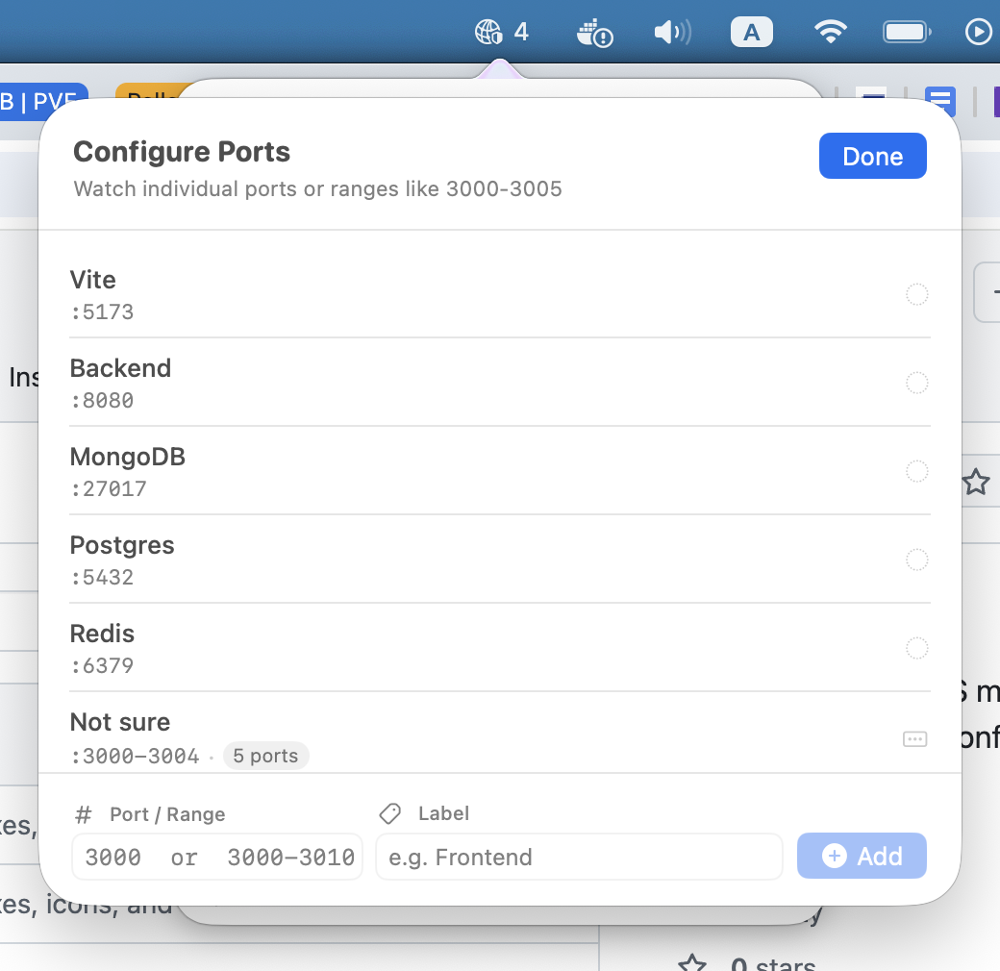

<p align="center">
  
</p>

<h1 align="center">PortoListo</h1>

<p align="center">
  A lightweight macOS menu bar app that monitors your configured localhost ports and shows which are in use.
</p>

<p align="center">
  
</p>

## Screenshots

<p align="center">
  
  
  
</p>

## Features

- Watch individual ports or ranges (e.g. `3000` or `3000-3010`)
- See which process and PID owns each port
- Tooltip with process path, uptime, and memory usage
- Open active ports in your browser with one click
- Inline label editing from the main view
- Auto-refreshes every 5s when open, 60s in background
- Configure your port list in Settings

## Install

1. Download the latest `.dmg` from [Releases](../../releases)
2. Open it and drag **PortoListo** to Applications
3. **Important:** On first launch, macOS will block the app because it isn't notarized. To open it:
   - **Right-click** (or Control-click) on PortoListo in Applications
   - Select **Open** from the context menu
   - Click **Open** in the dialog that appears
   - You only need to do this once — subsequent launches work normally

   Alternatively, remove the quarantine flag via Terminal:
   ```bash
   xattr -d com.apple.quarantine /Applications/PortoListo.app
   ```

## Build from source

Requires Xcode 15+ and macOS 13+.

```bash
xcodebuild -scheme PortoListo -configuration Release build
```

The built app will be in `~/Library/Developer/Xcode/DerivedData/PortoListo-*/Build/Products/Release/PortoListo.app`.

## How it works

PortoListo runs `netstat -anv -p tcp` to discover listening ports, then enriches each process with path, start time, and memory usage via lightweight Darwin syscalls (`proc_pidpath`, `sysctl`, `proc_pidinfo`). No root/sudo required.

## License

MIT
